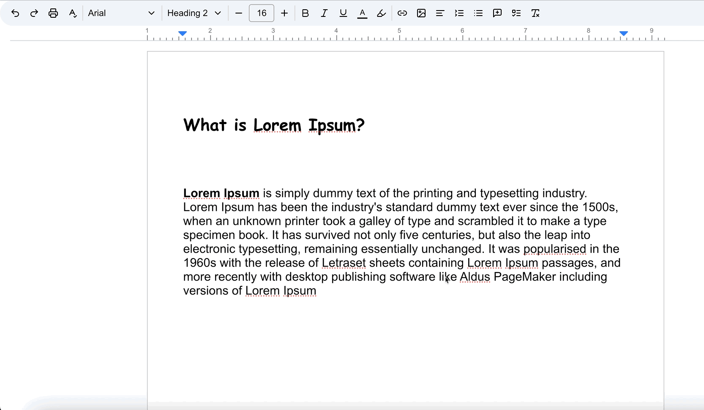

# tiptap-extension-line-height

[Tiptap](https://tiptap.dev/) is a suite of open source content editing and real-time collaboration tools for developers building apps like Notion or Google Docs.

This package provides the ability to adjust the line height of the tip tab text or paragraph.

<!-- It has been tested in 
[React](https://codesandbox.io/p/some_sandbox_link), and [NextJS](https://codesandbox.io/p/some_sandbox_link) -->
